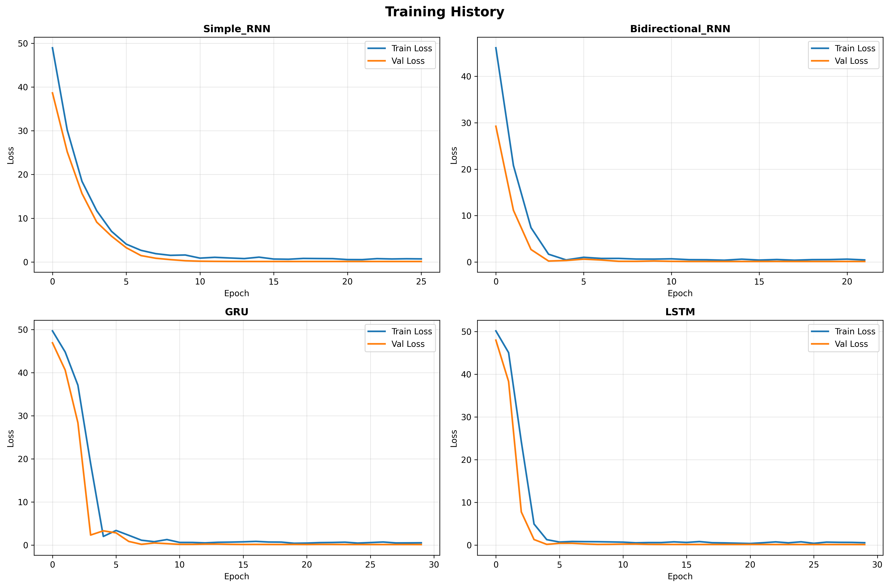
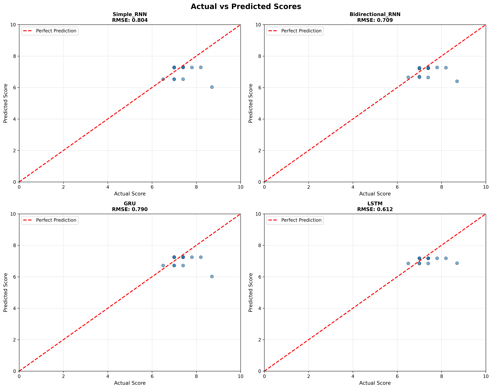
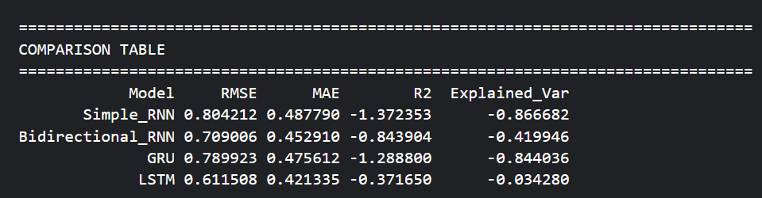

# Arabic Text Classification with RNN Models

## Project Overview

This project implements a complete pipeline for Arabic text classification using deep learning. The task involves collecting Arabic text data, preprocessing it, training multiple RNN architectures, and evaluating their performance.

## Project Tasks

### Part 1: Classification Task

1. **Data Collection**:
   - Crawl and scrape Arabic news articles from multiple sources
   - Follow article links and extract full article bodies
   - Assign relevance scores in the range **[0–10]**
2. **Preprocessing Pipeline**: Complete NLP pipeline including:
   - Text normalization (Arabic-specific)
   - Cleaning (punctuation, digits, non-Arabic characters)
   - Tokenization
   - Stopword removal 
   - Stemming or root extraction were excluded to preserve semantics
3. **Model Training**: Train 4 different architectures:
   - Simple RNN
   - Bidirectional RNN
   - GRU (Gated Recurrent Unit)
   - LSTM (Long Short-Term Memory)
4. **Evaluation**: Assess models using:
   - Standard metrics (RMSE, MAE, R², etc.)
   - BLEU score

## Running on Kaggle

### Step 1: Create a New Notebook

1. Go to [Kaggle](https://www.kaggle.com/)
2. Click **Create** → **New Notebook**
3. Enable GPU: Settings → Accelerator → GPU T4 x2 / GPU P100

### Step 2: Copy the Complete Code

Copy the entire code from `kaggle_complete_notebook.py` into your Kaggle notebook.

### Step 3: Install Dependencies

The notebook automatically installs required packages:
```python
!pip install -q scrapy beautifulsoup4 camel-tools pyarabic
```

### Step 4: Run All Cells

Execute the notebook cell by cell or use "Run All" to:
- Create the Arabic dataset
- Preprocess the text
- Train all 4 models
- Generate evaluation metrics and visualizations

## Dataset Structure

| Column | Description |
|--------|-------------|
| `text` | Original Arabic text |
| `score` | Relevance score (0-10) |
| `text_clean` | Preprocessed text |
| `score_category` | Discretized category (low/medium/high) |
| `score_label` | Numerical label (0 / 1 / 2) |

### Example Data

```
Text: الأمن السيبراني أصبح ضرورة لحماية الأنظمة الرقمية
Score: 8.7
Category: high
```

## Preprocessing Pipeline

The preprocessing includes the following steps:

1. **Normalization**:
   - Normalize Alef variants (أ، إ، آ → ا)
   - Normalize Teh Marbuta (ة → ه)
   - Normalize Ya (ى → ي)
   - Remove diacritics (Tashkeel)
   - Remove Tatweel (ـ)

2. **Cleaning**:
   - Remove English characters and numbers
   - Remove punctuation
   - Remove extra whitespace

3. **Tokenization**: Split text into words

4. **Stop Words Removal**: Remove common Arabic stop words

5. **Stemming**: Apply light stemming (remove prefixes/suffixes)

## Model Architectures

### 1. Simple RNN
```
Embedding → SimpleRNN(64) → Dropout → Dense → Output
```

### 2. Bidirectional RNN
```
Embedding → BiRNN(64) → Dropout → Dense → Output
```

### 3. GRU
```
Embedding → GRU(64) → Dropout → Dense → Output
```

### 4. LSTM
```
Embedding → LSTM(64) → Dropout → Dense → Output
```

## Hyperparameters

| Parameter | Value |
|-----------|-------|
| Max Words | 10000 |
| Max Length | 200 |
| Embedding Dim | 128 |
| Batch Size | 8 |
| Epochs | 30 |
| Learning Rate | 0.001 |
| Dropout Rate | 0.3 |

## Evaluation Metrics

### Regression Metrics
- **RMSE** (Root Mean Squared Error)
- **MAE** (Mean Absolute Error)
- **R² Score**
- **Explained Variance**
- **MAPE** (Mean Absolute Percentage Error)

### BLEU Scores
- BLEU-1, BLEU-2, BLEU-3, BLEU-4

## Project Structure

```
arabic-text-classification/
├── arabic_dataset.csv                  # Raw dataset
├── arabic_dataset_preprocessed.csv     # Preprocessed dataset
├── kaggle_complete_notebook.py         # Complete Kaggle notebook
├── training_history.png                # Training curves
├── predictions_comparison.png          # Actual vs Predicted plots
└── README.md                           # This file
```

## Visualizations

The notebook generates the following visualizations:

1. **Training History**: Loss curves for all models




2. **Predictions Comparison**: Actual vs Predicted scatter plots



3. **Metrics Comparison**: Bar charts comparing model performance



## Results Interpretation

### Best Model Selection

The best model is selected based on:
- Lowest RMSE and MAE (better prediction accuracy)
- Highest R² score (better explained variance)
- Highest BLEU score (better sequence quality)

### Performance

Simple_RNN:
  - RMSE: 0.8042
  - MAE: 0.4878
  - R2: -1.3724
  - Explained_Var: -0.8667

Bidirectional_RNN:
  - RMSE: 0.7090
  - MAE: 0.4529
  - R2: -0.8439
  - Explained_Var: -0.4199

GRU:
  - RMSE: 0.7899
  - MAE: 0.4756
  - R2: -1.2888
  - Explained_Var: -0.8440

LSTM:
  - RMSE: 0.6115
  - MAE: 0.4213
  - R2: -0.3717
  - Explained_Var: -0.0343

### Observations

   - Simple RNN performs worst on long texts
   - Bidirectional RNN improves context modeling
   - GRU converges faster
   - LSTM achieves the best overall performance

## Customization Options

### 1. Change Sequence Length
```python
MAX_LEN = 200
```

### 2. Change Vocabulary Size
```python
MAX_WORDS = 20000
```

### 3. Modify Model Architecture
```python
def build_custom_model():
    model = Sequential([
        Embedding(MAX_WORDS, EMBEDDING_DIM, input_length=MAX_LEN),
        LSTM(128),
        Dropout(0.3),
        Dense(1, activation='linear')
    ])
    return model
```

### 4. Web Scraping (Production)

   - Implemented using requests + BeautifulSoup
   - Article links are followed to extract full text
   - Pagination supported
   - Rate limiting applied to respect servers

## Important Notes

1. **Web Scraping**: Be respectful to servers
   - Add delays between requests
   - Check robots.txt
   - Use appropriate headers

2. **Arabic Text**: Ensure UTF-8 encoding
   ```python
   df.to_csv('file.csv', encoding='utf-8-sig')
   ```

3. **GPU Acceleration**: Enable GPU in Kaggle for faster training

4. **Memory Management**: For large datasets, use batch processing

## Required Libraries

```
tensorflow >= 2.0
numpy
pandas
scikit-learn
nltk
matplotlib
seaborn
beautifulsoup4
requests
```
---

## Part 2 — Text Generation with Transformers (GPT-2)

### Objective

The goal of Part 2 is to **fine-tune a pre-trained Transformer model (GPT-2)** and use it to **generate a coherent paragraph from a given input sentence**.

---

### Dataset Choice

For text generation, the **WikiText-103** dataset is used.

Reasons for this choice:
- Clean, encyclopedic English text
- Paragraph-level structure
- Widely used benchmark for language modeling
- No offensive or unsafe content
- Well suited for paragraph continuation tasks

A subset of **20,000+ paragraphs** is extracted and used for fine-tuning.

---

### Dataset Preparation (Part 2)

- Empty and very short lines are removed
- Each paragraph is explicitly delimited using GPT-2’s end-of-text token:

  <|endoftext|>
  [Paragraph text]
  <|endoftext|>

This enforces clear boundaries and improves generation coherence.

---

### Model Used (Part 2)

- **GPT-2 (small, 124M parameters)**
- Loaded from Hugging Face Transformers
- Fine-tuned using causal language modeling
- Training performed on GPU (Kaggle P100)

---

### Training Setup

Key settings:
- Block size: 128 tokens
- Learning rate: 2e-5
- Epochs: 3
- Mixed precision (FP16)
- AdamW optimizer

---

### Text Generation

After fine-tuning, the model generates new paragraphs given an initial prompt, for example:

"Artificial intelligence is transforming modern society by ..."

Generation is performed using controlled decoding:
- Temperature and nucleus sampling (top-p)
- Repetition penalty to reduce redundancy

---

### Observations & Limitations

- Generated text is generally coherent and on-topic
- Some factual inaccuracies and awkward phrasing remain
- These limitations are inherent to autoregressive language models such as GPT-2, which generate text based on statistical patterns rather than factual reasoning

This behavior is expected and discussed in the analysis.

---

## Technologies Used

- Python
- PyTorch
- TensorFlow / Keras
- Hugging Face Transformers
- Hugging Face Datasets
- NLTK
- Scikit-learn
- Matplotlib
- BeautifulSoup
- Requests

---

## Running the Project

The project is designed to run on **Kaggle notebooks with GPU enabled**.

Steps:
1. Create a new Kaggle notebook
2. Enable GPU (P100)
3. Upload the notebooks
4. Run all cells in order

---

## Key Takeaways

- Arabic NLP requires careful preprocessing to preserve semantics
- RNN variants (especially LSTM and GRU) outperform vanilla RNNs on long text
- Transformer-based models generate fluent text but may hallucinate facts
- Dataset quality and structure are critical for meaningful fine-tuning

---

## Contributing

Feel free to:
- Add more data sources
- Implement advanced preprocessing techniques
- Try different model architectures
- Improve evaluation metrics

## License

This project is for educational purposes.

## Author

Boudribila Kaoutar

## Acknowledgments

- Arabic NLP community
- TensorFlow and Keras teams
- Kaggle for providing free GPU resources
- Hugging Face for Transformers and Datasets

---

## Quick Start Command

```python
# In Kaggle notebook, simply run:
# 1. Copy the complete notebook code
# 2. Run all cells
# 3. View results and visualizations
```

**Happy Coding!**
